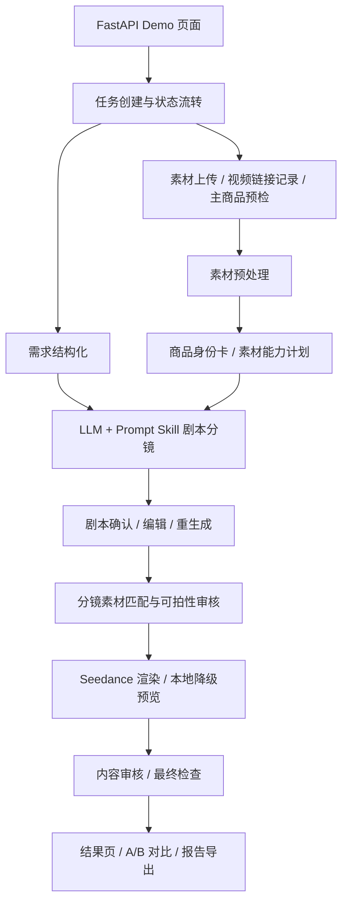

# 电商场景 AIGC 带货视频生成系统

面向商家的 AIGC 带货短视频生成 Demo。用户上传商品图片或视频参考素材，填写商品类型、卖点、使用场景、目标人群和风格后，系统自动完成素材理解、商品身份约束、剧本/分镜生成、视频渲染或本地降级预览、内容审核和结果展示。

当前版本是可运行 MVP / Demo。没有真实模型密钥时，项目会自动走本地降级链路，评审仍可完整体验“输入商品信息 -> 确认剧本 -> 生成视频草稿 -> 查看报告”的工程流程。

## 快速体验

推荐优先使用 Docker，能最大程度复现评审环境。没有 Docker 时再使用 `start.bat` 或 `start.sh`。

### Docker

```bash
docker compose up --build
```

启动后访问：

```text
http://127.0.0.1:8010
```

如果构建时因为 PyPI 网络问题下载依赖失败，可以切换镜像源：

```bash
docker compose build --no-cache --build-arg PIP_INDEX_URL=https://pypi.tuna.tsinghua.edu.cn/simple
docker compose up
```

### Windows

双击 `start.bat`，或在命令行执行：

```bat
start.bat
```

如果项目位于 `\\wsl.localhost\...` 路径下，脚本会自动转到 WSL 内执行 `start.sh`。

### macOS / Linux / WSL

```bash
chmod +x start.sh
./start.sh
```

### 手动启动

```bash
python -m pip install -e ".[dev]"
python task_creation_demo_app.py
```

## 配置说明

默认不需要模型密钥也能跑通本地 Demo。需要调用真实模型时，复制 `.env.example`：

```bash
cp .env.example .env
```

火山方舟文本/多模态和视频模型：

```bash
ARK_API_KEY=...
ARK_TEXT_ENDPOINT_ID=...
ARK_VIDEO_ENDPOINT_ID=...
AIGC_DISABLE_LLM=0
AIGC_DISABLE_VIDEO_MODEL=0
```

可选文本模型后端，用于需求结构化、剧本和分镜生成：

```bash
DEEPSEEK_API_KEY=...
DEEPSEEK_MODEL=deepseek-chat

# 或 OpenAI-compatible 文本接口
TEXT_LLM_BASE_URL=https://your-text-model-endpoint/v1
TEXT_LLM_MODEL=your-model-name
TEXT_LLM_API_KEY=...
AIGC_DISABLE_LLM=0
```

主要环境变量：

- `ARK_API_KEY`：火山方舟 API Key。
- `ARK_TEXT_ENDPOINT_ID`：文本/多模态模型 endpoint，用于素材理解、商品身份卡、剧本和分镜。
- `ARK_VIDEO_ENDPOINT_ID`：Seedance 视频模型 endpoint。
- `DEEPSEEK_API_KEY` / `DEEPSEEK_BASE_URL` / `DEEPSEEK_MODEL`：可选 DeepSeek 文本模型配置。
- `TEXT_LLM_BASE_URL` / `TEXT_LLM_MODEL` / `TEXT_LLM_API_KEY`：可选 OpenAI-compatible 文本模型配置。
- `AIGC_DISABLE_LLM=1`：禁用文本/多模态模型，使用规则兜底。
- `AIGC_DISABLE_VIDEO_MODEL=1`：禁用真实视频模型，使用本地预览降级。
- `AIGC_DISABLE_BACKGROUND_REMOVAL=1`：禁用 rembg 抠图。
- `HOST` / `PORT`：服务监听地址和端口，默认 `127.0.0.1:8010`。

不要提交 `.env`。仓库只保留 `.env.example` 空模板。

## 端到端流程

1. 用户打开 Demo 首页，填写商品标题、商品类型、核心卖点、使用场景、目标人群和视频风格。
2. 用户上传商品主图、参考图、商品视频或外部视频链接。
3. 系统创建任务，保存素材，并进行主商品预检。
4. 系统对素材进行标准化处理，生成商品身份卡、素材角色、可用外观锚点和风险信息。
5. 系统结合前端输入、素材理解和 prompt skill 生成带货剧本与分镜，先展示给用户确认。
6. 用户可以编辑剧本/分镜、填写修改意见并重新生成，或确认后继续视频生成。
7. 系统调用 Seedance 渲染 A/B 候选视频；未配置视频模型时生成本地预览视频。
8. 用户在结果页查看视频、分镜、素材绑定、审核状态和可导出的结构化任务报告。

## 核心功能

- 商品信息与多类型素材上传：支持商品图、参考素材、商品视频和外部视频链接。
- 素材理解与商品身份约束：把真实外观、关键结构、logo 风险、素材角色传递到剧本和渲染环节。
- 剧本确认与可编辑分镜：LLM 生成完整带货思路和分镜，用户可编辑、通过或带意见重生成。
- A/B 视频生成与本地降级：真实模型可生成候选视频；无密钥环境仍可输出可预览 MP4。
- 内容审核与报告导出：保留 workflow artifact、trace、审核结果和 `/tasks/{task_id}/report.json` 复核报告。

## 项目框架



系统分成六层：

- **交互层**：FastAPI 服务端页面，负责表单、素材上传、剧本确认、进度轮询、结果展示。
- **任务层**：任务实体、状态流转、进度事件、脚本审核状态和内存仓储。
- **素材层**：图片标准化、主商品候选、商品身份卡、素材角色和风险信息。
- **编排层**：把用户需求、素材理解、prompt skill、分镜、素材匹配、渲染和审核串成一个可复核工作流，并在模型调用失败、分镜不可拍、渲染失败时分别进入规则兜底、自动修复、本地预览或人工复核。
- **模型层**：文本/多模态模型负责需求、素材和剧本分镜；Seedance 负责视频生成；本地渲染负责无密钥降级。
- **质量层**：prompt safety、可拍性审核、内容审核、最终检查和任务报告导出。

## 项目亮点

1. **素材真实性贯穿全链路**：不是让模型凭空生成商品，而是把上传素材提炼成商品身份卡和素材能力计划，再传到剧本、分镜、素材匹配和最终视频 prompt。
2. **LLM 自由决策，代码只做边界控制**：带货表达策略放在 `prompt_skill_library/`，用正例、反例和失败标签引导模型，避免 Python 里写死“拿起又放下”这类模板镜头。
3. **可复核的工程产物**：结果页能看到 A/B 候选、分镜、素材绑定、审核状态和 JSON 报告；即使视频模型不可用，也能用本地降级证明端到端链路。

## 项目结构

- `task_creation_demo_app.py`：FastAPI 页面、素材上传、剧本确认、任务进度、结果展示和报告导出。
- `video_task_module.py`：任务领域模型、状态流转和内存仓储。
- `agent/`：素材预处理、需求结构化、剧本/分镜规划、Seedance 渲染、prompt 安全、内容修复和最终检查。
- `prompt_skill_library/`：带货视频 prompt skill，包含正例、反例、失败标签和最终 prompt 结构规范。
- `docs/submission/`：比赛提交材料。
- `tests/`：回归测试，覆盖素材绑定、前端字段传递、prompt 安全、A/B 结果、报告导出和 Docker 相关路径。

## 技术栈

- **前端/后端**：Python、FastAPI、HTML/CSS、原生 JavaScript、Uvicorn。
- **图像/视频处理**：Pillow、NumPy、imageio、imageio-ffmpeg、rembg、onnxruntime。
- **模型接入**：火山方舟文本/多模态模型、Seedance 视频模型；可选 DeepSeek 或 OpenAI-compatible 文本模型。
- **工程化**：Docker Compose、一键启动脚本、pytest 回归测试、结构化 artifact 和报告导出。

## 提交文档

评审优先阅读：

- `docs/submission/final_submission.md`：完整提报材料，覆盖功能清单、端到端流程、架构、技术栈、AI 能力、工程难点、完成度和创新点。
- `docs/submission/technical_story.md`：技术故事和创新点，解释为什么采用“脚本中心 + 商品身份卡 + 审核闭环”的方案，并补充 Agent 编排与失败兜底策略。
- `docs/submission/api_reference.md`：健康检查、任务状态和任务报告接口说明。

## 测试

```bash
python -m pytest -q
```

当前测试覆盖核心链路和关键回归场景；公开提交前建议先运行一次。
