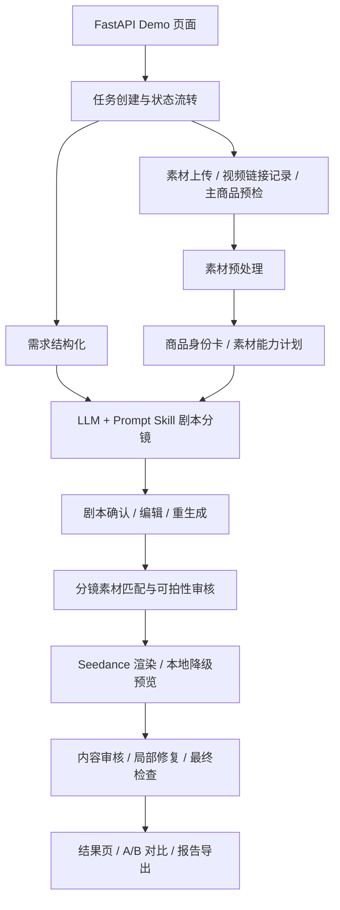

# 完赛项目提报内容

## 基础信息

| 字段 | 内容 |
| --- | --- |
| 提效形式 | 代码仓库 + 本地可运行 Demo + 演示视频 |
| 项目名称 | 电商场景 AIGC 带货视频生成系统 |
| 参赛课题 | 电商场景 AIGC 带货视频生成系统 |
| 团队名称与成员名单 | 待补充：需要填写真实团队信息 |
| 分工说明 | 待补充：单人项目可写“全栈开发、模型接入、产品设计、测试与文档” |

## 一句话核心业务价值

商家上传商品素材并填写卖点后，系统自动生成可预览、可编辑、可复核的带货短视频草稿，降低从商品素材到短视频内容的制作门槛。

## 核心功能清单

1. **商品信息与素材导入**：支持商品类型、卖点、场景、人群、风格、自定义描述，以及商品图、参考素材、商品视频和外部视频链接。
2. **素材理解与商品身份约束**：对上传素材生成商品身份卡、素材角色、可用外观锚点、logo/文字风险和素材能力计划，减少后续分镜和渲染丢失商品信息。
3. **LLM + prompt skill 剧本/分镜生成**：模型基于商品信息、素材边界和带货表达策略生成剧本、分镜、字幕、画面动作和渲染约束，代码只做合约校验和边界控制。
4. **剧本干预与继续生成**：用户可在前端查看可读剧本，直接编辑分镜，也可以带修改意见重新生成，通过后再进入视频渲染。
5. **A/B 候选视频与本地降级**：配置 Seedance 时生成 A/B 候选视频；无模型密钥时使用本地预览视频兜底，保证评审环境可以跑通。
6. **审核、trace 和报告导出**：保留任务状态、workflow artifact、分镜素材绑定、渲染结果、内容审核、最终检查和 JSON 报告，便于复盘。

## 端到端使用流程

1. 用户打开 Demo 页面，填写商品标题、商品类型、核心卖点、使用场景、目标人群和视频风格。
2. 用户上传商品主图、参考图、商品视频，或填写外部视频素材链接。
3. 系统创建任务并进入详情页，对素材进行保存、预处理和主商品候选识别。
4. 系统结构化前端输入，结合素材生成商品身份卡、素材角色和素材能力计划。
5. 系统调用文本/多模态模型和 prompt skill 生成带货剧本与分镜，并在前端展示给用户确认。
6. 用户可编辑剧本和分镜、填写反馈重生成，或确认后继续进入视频生成。
7. 系统调用 Seedance 生成 A/B 候选视频；如果没有视频模型配置，则生成本地预览 MP4。
8. 用户在结果页查看视频、分镜、素材绑定、审核信息和任务报告，并可下载成片或导出 JSON 报告。

## 交付材料

| 字段 | 内容 |
| --- | --- |
| 在线 Demo 链接 | 待补充：如无公网部署，可使用本地启动说明和演示视频替代 |
| 演示视频链接 | 待补充：建议 3-8 分钟，展示输入、剧本确认、生成结果、A/B 和报告导出 |
| 源代码仓库链接 | `https://github.com/helanfxz/aigc-product-video-demo`，分支 `main`，最后提交以 GitHub 页面为准 |
| README / 运行说明 | 根目录 `README.md` |
| 本地体验地址 | `http://127.0.0.1:8010` |

## 系统架构图



## 架构分层

- **前端与交互层**：`task_creation_demo_app.py` 使用 FastAPI 服务端渲染页面，提供任务创建、素材上传、剧本确认、进度轮询、视频预览和报告导出。
- **任务与状态层**：`video_task_module.py` 管理任务领域对象、状态流转、进度事件、脚本审核状态和内存仓储。
- **Agent 编排层**：`agent/video_generation_workflow.py` 串联需求结构化、素材理解、剧本分镜、素材匹配、渲染、审核和 artifact 落盘。
- **素材与视觉层**：`agent/asset_preprocessor.py` 负责图片标准化、主商品候选、统一背景锚点和素材能力标签。
- **渲染与后处理层**：`agent/seedance_video_renderer.py` 调用 Seedance，处理分镜并发、视频下载、拼接、字幕叠加和失败降级。
- **安全与质量层**：`agent/prompt_safety.py`、`agent/content_repair.py`、`agent/final_checks.py` 负责 prompt 边界、内容修复、审核和最终状态判定。
- **Prompt Skill 层**：`prompt_skill_library/` 存放带货表达策略、正反例、失败标签和 prompt 块规范，避免把创作策略硬编码在代码里。

## 核心技术栈

- **前端 / 后端 Demo**：Python、FastAPI、HTML/CSS、原生 JavaScript、Uvicorn。
- **数据与状态**：内存任务仓储、文件系统 `.uploads/` artifact、结构化 JSON 报告；当前没有引入数据库，便于评审本地运行。
- **图像与视频处理**：Pillow、NumPy、imageio、imageio-ffmpeg、rembg、onnxruntime。
- **模型能力**：火山方舟文本/多模态模型、Seedance 文生视频/图生视频；可选 DeepSeek 或 OpenAI-compatible 文本模型。
- **Prompt / Agent 方案**：无独立 RAG 或向量库；使用 prompt skill 文档库 + 规则合约 + 工作流 artifact 组织模型上下文。
- **部署与运行**：`start.bat`、`start.sh`、Dockerfile、Docker Compose；默认支持无密钥本地降级体验。
- **测试与质量**：pytest、httpx、prompt skill 合约测试、素材绑定回归、视频渲染契约测试。

## 大模型 / AI 能力使用说明

1. **文本模型**用于需求结构化、卖点拆解、剧本生成、导演分镜、A/B 策略和用户反馈重生成。支持火山方舟文本 endpoint、DeepSeek 和 OpenAI-compatible 接口。
2. **多模态模型**用于读取上传图片，提取商品外观、结构、可见标识、素材角色、质量评分和风险信息，并生成商品身份卡。
3. **视频模型**使用 Seedance 完成文生视频和图生视频分镜渲染；本地后处理负责字幕叠加、片段拼接和下载导出。
4. **Prompt skill 文档库**提供带货表达策略、适用条件、禁用条件、正例、反例和失败标签，指导模型自由决策但不越过素材边界。
5. **规则层**负责字段传递、素材绑定、prompt 安全、内容审核、失败标记和本地降级，避免模型输出不可执行内容时中断全链路。

## 关键工程难点与解决方案

1. **素材、剧本、分镜、渲染之间信息容易丢失**  
   解决方案：把商品身份卡、素材能力计划、分镜字段、素材绑定和最终 Seedance prompt 串成同一条结构化链路，并提供任务报告导出，便于定位哪一步丢失信息。

2. **视频模型容易生成错误商品、错误 logo 或无意义动作**  
   解决方案：优先使用真实商品素材作为图生视频锚点；prompt safety 限制模型绘制新文字、UI 和伪 logo；prompt skill 给出带货表达正反例；内容审核失败时进入 `needs_review`。

3. **长任务耗时且失败难复核**  
   解决方案：任务状态包含阶段、进度、事件和消息；工作流产物落盘；结果页展示 A/B 候选、trace summary、审核记录和最终检查；接口可导出 JSON 报告。

4. **评审环境可能没有模型密钥或网络条件不稳定**  
   解决方案：提供本地降级视频、Docker Compose、一键启动脚本和 `.env.example`，没有密钥也能跑通端到端流程。

## 部署与访问说明

本地运行：

```bash
./start.sh
```

Windows：

```bat
start.bat
```

Docker：

```bash
docker compose up --build
```

访问地址：

```text
http://127.0.0.1:8010
```

复核接口：

- `GET /api/health`：查看服务实例、端口、模型开关、配置状态和内存任务数量，不返回 API Key。
- `GET /api/tasks/{task_id}`：任务详情页使用的只读状态轮询接口。
- `GET /tasks/{task_id}/report.json`：导出单个任务的结构化报告，包含输入、剧本、分镜、渲染结果、A/B 候选、审核和 artifact 目录。

## 项目完成度

当前是可运行 MVP / Demo。P0 链路已经具备：商品素材上传、剧本生成、基础分镜、一键成片、任务进度、预览导出、本地降级和报告导出。P1/P2 中已实现部分能力：剧本干预、A/B 候选、生成 trace、字幕叠加、失败反馈和健康检查。尚未完整实现的能力包括：持久化素材库、向量检索、真实视频切片检索、TTS/BGM、多画幅导出和生产级队列。

## 项目亮点 / 创新点

详细技术故事见 `docs/submission/technical_story.md`。项目的核心思路是把“带货创意”先变成可读、可编辑、可审核的脚本和分镜，再交给视频模型执行；商品身份、素材边界和审核结果贯穿整个链路。

1. **把“素材真实性”作为主线，而不是单 prompt 直出视频**  
   系统从上传素材开始生成商品身份卡和素材能力计划，后续剧本、分镜、素材匹配、Seedance prompt 和审核都复用同一组约束，解决商品外观、logo、结构在多步骤生成中丢失的问题。

2. **LLM 自由创作 + Prompt Skill 合约约束**  
   创作策略不写死在 Python 模板里，而是放在 prompt skill 文档中，给模型正例、反例、失败标签和可拍性边界。代码只负责校验、素材绑定、风险控制和降级，避免反复出现“拿起又放下”这类模板化镜头。

3. **面向评审可复核的工程链路**  
   任务详情页不仅展示视频，还展示剧本、分镜、素材绑定、A/B 候选、trace、审核和报告导出。即使视频模型失败，也能通过本地降级和 artifact 证明端到端流程完整可运行。

## 仍需提交前补充

- 团队名称、成员名单和真实分工。
- 在线 Demo 链接；如无公网部署，可用本地启动说明和录屏替代。
- 演示视频链接。
- GitHub 仓库改为 public 后，确认仓库链接、分支和最后提交记录。
