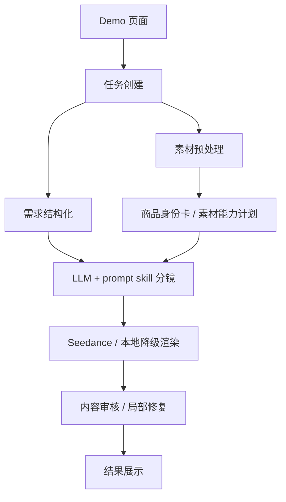

# 完赛项目提报内容

## 基础信息

| 字段 | 内容 |
| --- | --- |
| 提效形式 | 统一飞书文档 / 代码仓库 / 本地可运行 Demo |
| 项目名称 | 电商场景 AIGC 带货视频生成系统 |
| 参赛课题 | 电商场景 AIGC 带货视频生成系统 |
| 团队名称与成员名单 | 待补充：需要用户填写真实团队信息 |
| 分工说明 | 待补充：需要用户填写成员分工；单人项目可写“全栈开发、模型接入、产品设计、测试与文档” |

## 一句话核心业务价值

商家上传商品素材并填写卖点后，系统自动生成可预览、可复核的带货短视频草稿，降低从商品素材到短视频内容的制作门槛。

## 核心功能清单

1. 商品信息填写与素材上传：支持商品类型、核心卖点、使用场景、目标人群、风格和自定义描述。
2. 多模态素材理解：生成商品身份卡、素材角色、可用外观锚点和风险信息。
3. LLM + prompt skill 分镜规划：根据素材、卖点和目标场景生成带货分镜，避免把商品动作硬编码在代码里。
4. 视频渲染与本地降级：有模型密钥时调用 Seedance；没有密钥时输出本地预览视频，保证链路可跑通。
5. 内容审核与修复：记录分镜、素材绑定、渲染结果、内容审核和最终检查，失败时进入 `needs_review`。
6. A/B 候选与可观测 artifact：保留不同策略的分镜、prompt 和视频产物，方便复盘生成质量。

## 端到端使用流程

1. 用户打开 Demo 页面，填写商品标题、商品类型、卖点、使用场景、目标人群和风格。
2. 用户上传商品主图或参考素材。
3. 系统创建任务，并对素材进行标准化预处理和商品主体分析。
4. 系统结构化用户需求，结合素材理解生成商品上下文和素材能力计划。
5. 系统调用 LLM / prompt skill 生成分镜，并完成可拍性检查与素材绑定。
6. 系统调用 Seedance 渲染视频；未配置模型时自动使用本地预览降级。
7. 系统抽帧审核视频内容，记录商品一致性、卖点表达和失败原因。
8. 用户在任务详情页查看视频、分镜、素材绑定、审核记录和最终状态。

## 交付材料

| 字段 | 内容 |
| --- | --- |
| 在线 Demo 链接 | 待补充：需要部署后填写；本地可通过 `start.bat`、`./start.sh` 或 `docker compose up --build` 启动 |
| 演示视频链接 | 待补充：需要录屏后填写 |
| 源代码仓库链接 | 待补充：需要发布到 GitHub / GitLab 后填写 |
| README / 运行说明 | 根目录 `README.md` |
| 本地体验地址 | `http://127.0.0.1:8010` |

## 系统架构图

详见 `docs/submission/system_architecture.md`。



## 核心技术栈

- 前端与后端 Demo：Python、FastAPI、HTML/CSS/原生 JS、Uvicorn。
- 数据与状态：内存任务仓储、文件系统 artifact、结构化 JSON。
- 图像与视频处理：Pillow、NumPy、imageio、imageio-ffmpeg、rembg、onnxruntime。
- 模型能力：火山方舟文本/多模态模型、Seedance 文生视频 / 图生视频。
- 测试与质量：pytest、httpx、prompt skill 合约测试、内容安全回归测试。
- 打包运行：`start.bat`、`start.sh`、Dockerfile、Docker Compose。

## 大模型 / AI 能力使用说明

1. 文本 / 多模态 LLM 用于需求结构化、素材理解、商品身份卡、剧本和分镜规划。
2. Prompt skill 文档提供镜头类型、正例、反例、失败标签和最终 prompt 结构，减少模型跑偏。
3. Seedance 用于文生视频和图生视频渲染。
4. 规则层负责字段传递、素材绑定、prompt 安全、内容审核、失败标记和本地降级，不把创作动作写死在 Python 中。

## 关键工程难点与解决方案

1. 素材、剧本、分镜和渲染之间信息容易丢失。解决方案：商品身份卡、素材能力计划、分镜字段、素材绑定和最终 prompt 共同传递约束。
2. 视频模型容易生成错误商品、错误 logo 或无意义手部动作。解决方案：真实素材优先、prompt safety、prompt skill 正反例、可拍性审核和内容审核。
3. 长任务失败难复核。解决方案：任务状态、workflow artifact、A/B 候选、渲染结果、内容审核和最终检查全部落盘。
4. 评审环境可能没有模型密钥。解决方案：本地预览降级 + 一键启动脚本 + Docker Compose，保证项目下载后可跑通。

## 部署与访问说明

本地运行：

```bash
./start.sh
```

Windows：

```bat
start.bat
```

Docker：

```bash
docker compose up --build
```

访问地址：

```text
http://127.0.0.1:8010
```

可复核接口：

- `GET /api/health`：查看服务实例、端口、模型开关、配置状态和内存任务数量，不返回任何 API Key。
- `GET /tasks/{task_id}/report.json`：导出单个任务的结构化报告，包含任务输入、工作流结果、artifact 目录和 A/B 视频摘要。
- `GET /api/tasks/{task_id}`：任务详情页使用的只读状态轮询接口。

## 项目完成度

当前是可运行 MVP / Demo。P0 链路已具备：素材上传、剧本/分镜生成、一键成片、本地预览降级、任务进度、预览导出、审核和失败反馈。真实视频效果仍需要通过更多商品样本继续调优。

## 项目亮点 / 创新点

1. 不是单 prompt 直出视频，而是保留素材理解、商品身份、分镜、素材绑定、渲染和审核的完整工程链路。
2. 支持无模型密钥的本地降级演示，评审可以复核端到端流程。
3. 用 prompt skill 文档承载创作样例，把策略交给 LLM 决策，代码只做合约与边界控制。
4. A/B 候选和 artifact 留痕便于比较不同策略的视频质量。
5. 内容审核失败不会伪装成功，而是进入 `needs_review` 并保留修复依据。

## 仍需用户补充

- 团队名称、成员名单和真实分工。
- 在线 Demo 链接。
- 演示视频链接。
- 源代码仓库链接、分支和最后提交记录。
- 如果有真实部署环境，需要补充公网访问说明和体验账号。
