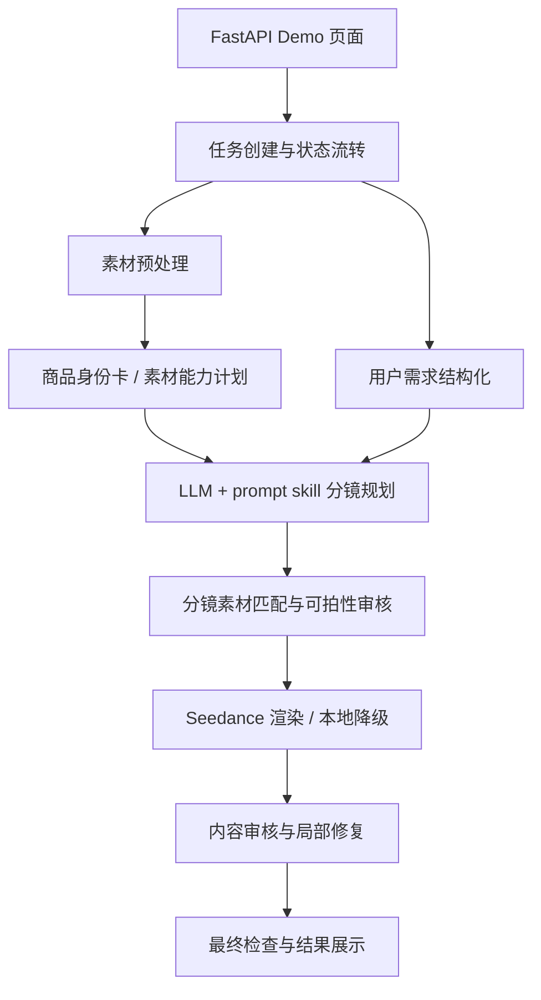

# 系统架构说明

## 分层说明

- 前端入口：`task_creation_demo_app.py` 提供任务创建、素材上传、进度查看和结果展示。
- 任务层：`video_task_module.py` 负责领域对象、状态流转和内存仓储。
- Agent 编排层：`agent/video_generation_workflow.py` 串联需求、素材、分镜、渲染和审核。
- 素材层：`agent/asset_preprocessor.py` 生成标准化素材、主商品候选和视觉锚点。
- 渲染层：`agent/seedance_video_renderer.py` 调用 Seedance，并处理下载、拼接、字幕和单镜修复。
- 安全与审核层：`agent/prompt_safety.py`、`agent/content_repair.py`、`agent/final_checks.py` 负责 prompt 边界、内容修复和最终状态。
- Prompt skill 层：`prompt_skill_library/` 承载正例、反例和 prompt 结构规范，避免把创作策略硬编码在 Python 中。

## 技术栈

- 后端 / Demo：Python、FastAPI、Pydantic、Uvicorn。
- 图像与视频处理：Pillow、NumPy、imageio、imageio-ffmpeg、rembg、onnxruntime。
- 模型能力：火山方舟文本/多模态模型、Seedance 文生视频和图生视频。
- 测试：pytest、httpx。

## 关键工程难点

- 商品身份一致性：真实商品图、分镜和视频 prompt 之间容易丢失外观、logo、颜色和结构信息。系统通过商品身份卡、素材能力计划、分镜字段和渲染门禁持续传递约束。
- 带货表达不应模板化：旧方案容易生成“拿起又放下”“摸一下商品”这类无意义动作。当前方案把创作样例放到 prompt skill 文档，由 LLM 结合素材、卖点和场景自由决策，Python 只做校验和兜底。
- 长任务可复核：视频生成耗时长且可能失败。系统保留任务状态、分镜、素材匹配、渲染结果、审核记录和最终检查，失败时进入 `needs_review` 而不是伪装成功。
