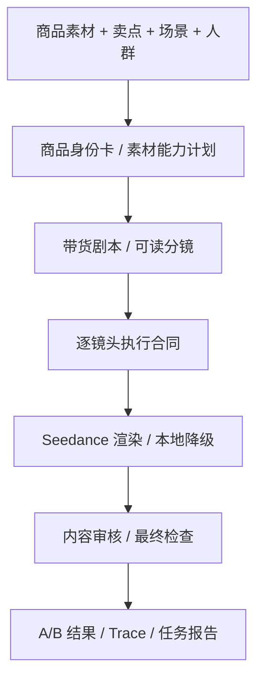

# 技术故事与创新点

## 为什么不是“商品图 + 卖点 + 一个超长 prompt”

电商带货视频看起来是一个简单任务：给模型一张商品图，再告诉它“突出便携、防漏、轻薄、高性能”。但实际生成时会出现三个典型问题：

1. **画面漂亮但不卖货**：模型会生成商品特写、手摸一下、拿起又放下这类镜头，看起来像广告素材，但没有痛点、使用结果和购买理由。
2. **剧情丰富但商品不对**：一旦放开场景，模型会生成“类似商品”，logo、颜色、结构、比例和原素材不一致。
3. **剧本合理但视频模型执行不了**：LLM 能写出“通勤者把水杯放进包里走进办公室”，但视频模型可能把包、桌面、杯子、人物混成一个空间，或者在 5 秒里塞入过多动作。

因此本项目没有把所有信息拼成一个长 prompt 直接交给视频模型，而是把“带货创意”拆成一条可执行、可审核、可复盘的工程链路。

## 我们的核心判断：先把意图变成可执行脚本，再生成视频

当前视频模型已经能生成质量不错的短片段，但它并不天然理解电商视频里的“商品必须真实、卖点必须可见、动作必须可拍、结果必须能证明”。如果直接把“做一条带货视频”交给视频模型，它会把创作、商品保真、镜头执行、字幕和审核全部混在一次生成里，任何一环出错都很难定位。

所以我们把系统设计成“脚本中心”的工作流：先把商家的高层诉求转换成可读剧本和分镜，再把每个分镜压成视频模型能执行的镜头合同。这里的“脚本”不是简单文案，而是连接素材、卖点、镜头、动作、字幕、素材绑定和审核的中间表示。

电商场景里的核心对象不是抽象角色，而是商品。商品的颜色、结构、logo、比例、材质和使用方式都必须稳定。因此项目采用的是商品身份驱动的脚本链路：

这条链路的目的不是声称模型永远不会出错，而是让系统知道：哪个镜头必须保真，哪个镜头可以讲故事，哪个动作超出视频模型能力，哪个失败应该回到人工审核。

## 创新点一：商品身份卡，让素材真实性贯穿全链路

带货视频和普通故事视频最大的区别是：视频里的商品必须是用户上传的商品，而不是模型想象出来的同类商品。

项目会先把上传素材转成商品身份卡和素材能力计划，记录：

- 商品类型、颜色、轮廓、关键结构；
- 可见 logo、文字、标识和高风险区域；
- 必须保持的外观特征；
- 禁止变化的结构和动作；
- 哪张素材适合做外观锚点，哪张适合做细节参考，哪张只适合作为场景参考。

后续剧本、分镜、素材匹配、Seedance prompt 和内容审核都会引用这些字段。这样“商品一致性”不再是 prompt 里一句泛泛的“保持同一商品”，而变成贯穿工作流的结构化约束。

## 创新点二：把“剧本”拆成用户可读故事和模型可执行合同

一个给人看的好剧本，不一定是视频模型能执行的好 prompt。比如“展示通勤场景中随手携带”对用户很清楚，但对视频模型来说，需要进一步明确：

- 第一秒商品在哪里；
- 手从哪个方向进入；
- 商品和包、桌面、人物是什么空间关系；
- 一个镜头里只发生一个主动作；
- 最后一帧应该停在什么可验收状态；
- 是否允许离开原素材场景。

因此项目把剧本拆成两层：

1. **可读剧本**：让用户理解视频想讲什么、卖点如何展开、分镜是否符合预期。
2. **执行合同**：给视频模型的镜头级自然语言 prompt，包含动作边界、商品约束、素材绑定、字幕和禁止项。

用户可以在前端先看到剧本和分镜，直接编辑，或者带意见重新生成。通过后系统才进入视频生成。这避免了“模型先生成一堆视频，用户才发现剧本方向不对”的浪费。

## 创新点三：Prompt Skill 不是模板，而是创作方法论

项目中保留了 `prompt_skill_library/`，但它不是商品类型 if/else 模板，也不是“水杯固定怎么拍、电脑固定怎么拍”的硬编码脚本。

Prompt Skill 的作用更接近导演手册：

- 正例：什么样的镜头能证明便携、质感、收纳、使用结果；
- 反例：哪些镜头会变成无意义动作，例如只摸一下商品、拿起又放下；
- 禁用条件：什么时候不能要求换场景、不能要求高精度 logo 重绘、不能在 5 秒里塞多个动作；
- 失败标签：商品漂移、logo 变形、场景冲突、第二个商品、字幕误入画面；
- prompt 块规范：最终交给视频模型的内容必须是自然语言镜头描述，而不是内部 JSON、策略 id 或评分。

这让 LLM 可以自由决策带货表达，同时系统仍能约束素材边界和视频模型能力边界。

## 创新点四：A/B 不是花哨功能，而是处理保真和带货之间的真实矛盾

实验中最明显的矛盾是：

- 如果每个镜头都强绑定上传素材，商品更稳定，但视频容易像“素材图加轻微动效”；
- 如果放开素材绑定，场景更自然，带货感更强，但商品可能不再是原商品。

所以系统不强行选择唯一策略，而是尽量输出 A/B 两个方向：

- **A 版偏保真**：更强调真实素材锚定、结构稳定、logo 风险可控。
- **B 版偏带货表达**：更强调使用场景、结果状态和卖点证明。

结果页同时展示候选视频、分镜和报告，让用户和评审能看到系统如何在“商品真实性”和“转化表达”之间取舍。

## 创新点五：失败不伪装成功，链路可复核

视频生成是长任务，失败可能来自素材不足、剧本不可拍、视频模型漂移、接口超时、下载失败或审核不通过。如果只展示“生成失败”或“生成完成”，评审无法判断系统能力边界。

本项目把可复核性作为工程能力：

- 任务状态持续记录阶段、进度和事件；
- workflow artifact 落盘保存素材分析、剧本、分镜、素材匹配、创作计划、渲染结果、审核和最终检查；
- 结果页展示 A/B 视频、分镜、素材绑定和 trace summary；
- `/tasks/{task_id}/report.json` 可以导出结构化报告；
- `/api/health` 可以检查服务、端口、模型开关和配置状态，但不暴露任何密钥。

这让项目不是一个黑盒 demo，而是一条可以解释、可以定位问题、可以继续迭代的生成工作流。

## 当前边界

当前版本是可运行 MVP，不是生产级广告系统。它已经跑通“素材 -> 剧本 -> 分镜 -> 视频 -> 审核 -> 报告”的主链路，但还有一些明确边界：

- 没有接入持久化素材库和向量检索；
- 没有做真实视频切片检索和智能混剪；
- TTS、BGM、多画幅导出仍是后续扩展；
- 高精度 logo 和复杂文字复刻仍受视频模型能力限制；
- B 版场景化表达更接近带货视频，但商品一致性风险也更高。

项目的取舍是先完成一个“能讲清楚、能运行、能复核、能继续迭代”的工程原型，而不是只追求一次性生成最炫的视频。
