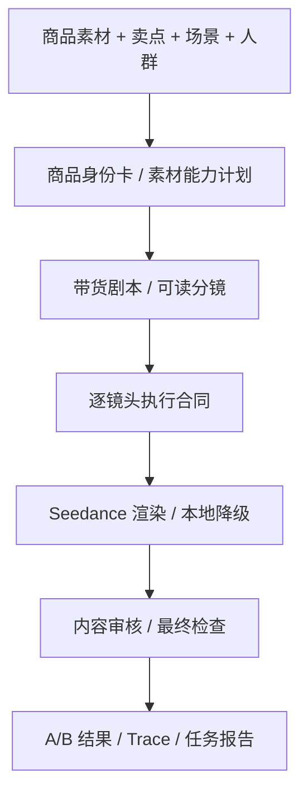
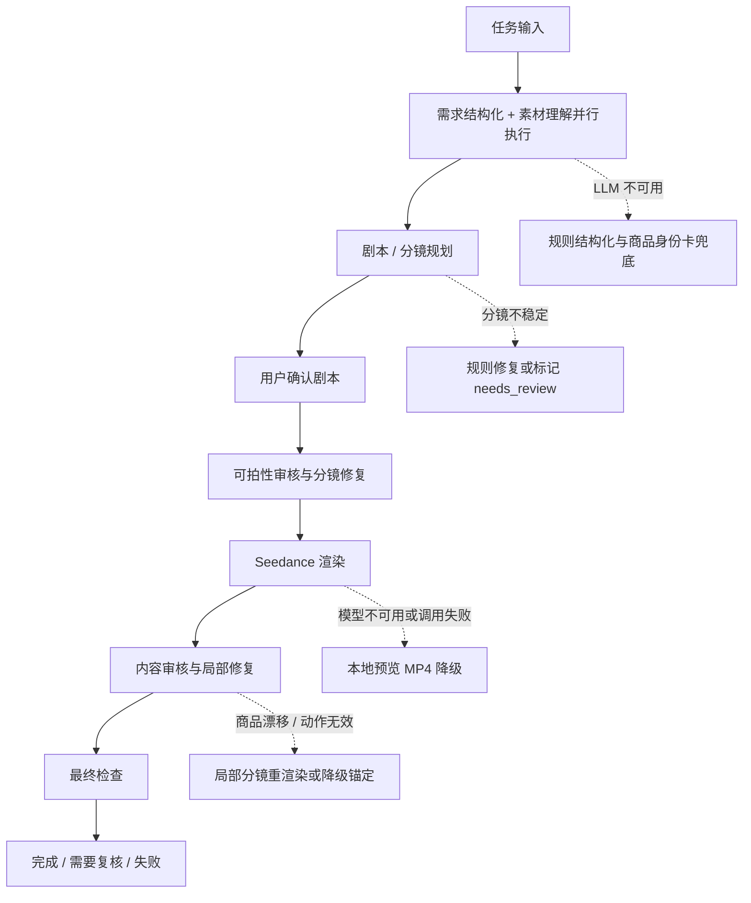

# 技术故事与创新点

## 为什么不是“商品图 + 卖点 + 一个超长 prompt”

电商带货视频看起来是一个简单任务：给模型一张商品图，再告诉它“突出便携、防漏、轻薄、高性能”。但实际生成时会出现三个典型问题：

1. **画面漂亮但不卖货**：模型会生成商品特写、手摸一下、拿起又放下这类镜头，看起来像广告素材，但没有痛点、使用结果和购买理由。
2. **剧情丰富但商品不对**：一旦放开场景，模型会生成“类似商品”，logo、颜色、结构、比例和原素材不一致。
3. **剧本合理但视频模型执行不了**：LLM 能写出“通勤者把水杯放进包里走进办公室”，但视频模型可能把包、桌面、杯子、人物混成一个空间，或者在 5 秒里塞入过多动作。

因此本项目没有把所有信息拼成一个长 prompt 直接交给视频模型，而是把“带货创意”拆成一条可执行、可审核、可复盘的工程链路。

## 我们的核心判断：先把意图变成可执行脚本，再生成视频

当前视频模型已经能生成质量不错的短片段，但它并不天然理解电商视频里的“商品必须真实、卖点必须可见、动作必须可拍、结果必须能证明”。如果直接把“做一条带货视频”交给视频模型，它会把创作、商品保真、镜头执行、字幕和审核全部混在一次生成里，任何一环出错都很难定位。

所以我们把系统设计成“脚本中心”的工作流：先把商家的高层诉求转换成可读剧本和分镜，再把每个分镜压成视频模型能执行的镜头合同。这里的“脚本”不是简单文案，而是连接素材、卖点、镜头、动作、字幕、素材绑定和审核的中间表示。

电商场景里的核心对象不是抽象角色，而是商品。商品的颜色、结构、logo、比例、材质和使用方式都必须稳定。因此项目采用的是商品身份驱动的脚本链路：

这条链路的目的不是声称模型永远不会出错，而是让系统知道：哪个镜头必须保真，哪个镜头可以讲故事，哪个动作超出视频模型能力，哪个失败应该回到人工审核。

## 创新点一：商品身份卡，让素材真实性贯穿全链路

带货视频和普通故事视频最大的区别是：视频里的商品必须是用户上传的商品，而不是模型想象出来的同类商品。

项目会先把上传素材转成商品身份卡和素材能力计划，记录：

- 商品类型、颜色、轮廓、关键结构；
- 可见 logo、文字、标识和高风险区域；
- 必须保持的外观特征；
- 禁止变化的结构和动作；
- 哪张素材适合做外观锚点，哪张适合做细节参考，哪张只适合作为场景参考。

后续剧本、分镜、素材匹配、Seedance prompt 和内容审核都会引用这些字段。这样“商品一致性”不再是 prompt 里一句泛泛的“保持同一商品”，而变成贯穿工作流的结构化约束。

## 创新点二：把“剧本”拆成用户可读故事和模型可执行合同

一个给人看的好剧本，不一定是视频模型能执行的好 prompt。比如“展示通勤场景中随手携带”对用户很清楚，但对视频模型来说，需要进一步明确：

- 第一秒商品在哪里；
- 手从哪个方向进入；
- 商品和包、桌面、人物是什么空间关系；
- 一个镜头里只发生一个主动作；
- 最后一帧应该停在什么可验收状态；
- 是否允许离开原素材场景。

因此项目把剧本拆成两层：

1. **可读剧本**：让用户理解视频想讲什么、卖点如何展开、分镜是否符合预期。
2. **执行合同**：给视频模型的镜头级自然语言 prompt，包含动作边界、商品约束、素材绑定、字幕和禁止项。

用户可以在前端先看到剧本和分镜，直接编辑，或者带意见重新生成。通过后系统才进入视频生成。这避免了“模型先生成一堆视频，用户才发现剧本方向不对”的浪费。

## 创新点三：Prompt Skill 不是模板，而是创作方法论

项目中保留了 `prompt_skill_library/`，但它不是商品类型 if/else 模板，也不是“水杯固定怎么拍、电脑固定怎么拍”的硬编码脚本。

Prompt Skill 的作用更接近导演手册：

- 正例：什么样的镜头能证明便携、质感、收纳、使用结果；
- 反例：哪些镜头会变成无意义动作，例如只摸一下商品、拿起又放下；
- 禁用条件：什么时候不能要求换场景、不能要求高精度 logo 重绘、不能在 5 秒里塞多个动作；
- 失败标签：商品漂移、logo 变形、场景冲突、第二个商品、字幕误入画面；
- prompt 块规范：最终交给视频模型的内容必须是自然语言镜头描述，而不是内部 JSON、策略 id 或评分。

这让 LLM 可以自由决策带货表达，同时系统仍能约束素材边界和视频模型能力边界。

## 创新点四：A/B 不是花哨功能，而是处理保真和带货之间的真实矛盾

实验中最明显的矛盾是：

- 如果每个镜头都强绑定上传素材，商品更稳定，但视频容易像“素材图加轻微动效”；
- 如果放开素材绑定，场景更自然，带货感更强，但商品可能不再是原商品。

所以系统不强行选择唯一策略，而是尽量输出 A/B 两个方向：

- **A 版偏保真**：更强调真实素材锚定、结构稳定、logo 风险可控。
- **B 版偏带货表达**：更强调使用场景、结果状态和卖点证明。

结果页同时展示候选视频、分镜和报告，让用户和评审能看到系统如何在“商品真实性”和“转化表达”之间取舍。

## 创新点五：失败不伪装成功，链路可复核

视频生成是长任务，失败可能来自素材不足、剧本不可拍、视频模型漂移、接口超时、下载失败或审核不通过。如果只展示“生成失败”或“生成完成”，评审无法判断系统能力边界。

本项目把可复核性作为工程能力：

- 任务状态持续记录阶段、进度和事件；
- workflow artifact 落盘保存素材分析、剧本、分镜、素材匹配、创作计划、渲染结果、审核和最终检查；
- 结果页展示 A/B 视频、分镜、素材绑定和 trace summary；
- `/tasks/{task_id}/report.json` 可以导出结构化报告；
- `/api/health` 可以检查服务、端口、模型开关和配置状态，但不暴露任何密钥。

这让项目不是一个黑盒 demo，而是一条可以解释、可以定位问题、可以继续迭代的生成工作流。

## Agent 编排与失败兜底

项目没有为了形式引入复杂的多 Agent 框架，而是在 `agent/video_generation_workflow.py` 里实现了一条轻量的 Agent 编排链路。每个环节都有明确输入、输出、状态和 artifact，失败时不会直接中断整条链路，而是根据失败类型选择“规则兜底、自动修复、本地降级、进入复核”中的一种。

具体策略如下：

| 环节 | 失败场景 | 兜底策略 | 对用户/评审的呈现 |
| --- | --- | --- | --- |
| 需求结构化 | 文本模型未配置、调用失败、返回不可解析 | 使用规则兜底生成商品类型、卖点、场景、人群等结构化字段 | artifact 中记录 fallback reason，后续流程继续运行 |
| 素材理解 | 多模态模型不可用或图片分析失败 | 从任务输入、文件类型、主素材候选和规则摘要生成商品身份卡 | 保留素材角色、主素材路径和风险字段，避免后续完全丢失商品信息 |
| 剧本/分镜 | LLM 分镜缺字段、叙事不完整、镜头不可拍 | 先做字段补齐和可拍性修复；仍有风险时进入 `needs_review`，由用户在剧本页确认或重生成 | 前端显示可读剧本和分镜，不直接进入黑箱渲染 |
| 素材匹配 | 某个分镜缺少合适素材锚点 | 记录 asset gap，降低该镜头的素材绑定强度或要求复核 | 结果页和报告展示素材绑定与缺口，不把缺口静默隐藏 |
| 视频渲染 | Seedance 未配置、网络失败、下载失败或接口错误 | 使用本地预览渲染器生成可播放 MP4；部分分镜失败时保留成功片段并记录失败原因 | 结果页展示 `fallback_from`，评审仍可体验端到端链路 |
| 内容审核 | 出现商品漂移、错误 logo、无意义动作、第二商品等 | 按审核标签选择局部修复策略，例如强化身份锚点、简化动作、重写镜头目标或使用本地身份锚定 | 修复次数、成功/失败记录写入 trace summary 和 report |
| 最终检查 | 渲染结果、内容审核或 artifact 不满足条件 | 不把任务标记成 completed，而是进入 `needs_review` 或 `failed` | 任务状态、错误信息和报告都可复核 |

这个设计的重点不是让系统假装“全自动永远成功”，而是让每一步失败都有明确的处理方式。对于评审环境尤其重要：没有真实模型 Key 时，系统仍能通过规则兜底和本地预览跑通；有真实模型 Key 时，系统会尽量调用模型生成 A/B 候选，并在内容审核阶段记录是否需要人工复核。

## 开发过程中的关键痛点与迭代

### 痛点一：logo 和商品身份频繁不稳定

早期实验中，我们以为只要在 prompt 里写“保持同一商品、保持 logo 不变”，视频模型就能理解。但实际生成水杯、笔记本、包装类商品时，经常出现几类问题：

- logo 被重画成不存在的文字；
- 字母和小标识变形；
- 商品颜色大致相似，但结构和比例变了；
- 文生视频会生成一个“看起来像同类商品”的新商品，而不是上传素材里的商品。

后续改进不是继续堆更长的 logo prompt，而是把 logo 问题放进商品身份约束里处理：

- 在素材分析阶段生成商品身份卡，单独记录 `visible_marks`、`must_preserve`、`forbidden_changes`；
- 对高风险文字/logo，不要求视频模型“重新绘制”，只允许保持首帧已有标识或作为低对比度小面积标识处理；
- 图生视频优先绑定真实上传素材，文生视频只在不要求高精度复刻的镜头中使用；
- 渲染 prompt 清理字幕、按钮、购物车图标和 CTA 文案，避免模型把营销文字画进视频里；
- 内容审核阶段把 `wrong_logo`、`product_drift`、`second_product_generated` 这类问题记录下来，而不是直接判定成功。

当前效果是：商品身份比纯 prompt 方案稳定，尤其是外观锚定镜头更可靠；但高精度 logo、二维码、密集包装文字仍然不能保证完美复刻，所以文档和报告里会明确记录风险。

### 痛点二：素材绑定越强，视频越像“会动的图片”

另一个阶段我们尝试过强保真路线：所有商品镜头尽量从上传素材首帧出发。这个策略确实减少了商品变形，但视频会变得很单薄，常见结果是轻微推镜、光影变化、手碰一下、拿起又放下，带货价值不足。

后来我们把镜头职责拆开，而不是让每个镜头都承担同一个目标：

- 外观确认镜头负责证明“这是上传素材里的商品”；
- 动作证明镜头负责用低风险动作承接一个卖点；
- 场景结果镜头负责展示使用结果或生活场景；
- 痛点镜头可以不出现商品，但不能生成同类替代商品。

这让系统能在保真和带货表达之间留出空间。A 版偏商品稳定，B 版偏卖点证明和场景表达。它不是完美解决方案，但比单一路线更适合展示模型能力边界，也方便用户选择更可用的版本。

### 痛点三：剧本看起来合理，但视频模型执行后变成无意义动作

开发中反复出现过一种情况：LLM 生成的分镜文案看起来没有问题，但视频模型执行时变成“手摸一下杯子”“拿起又放下”“人物喝水但看不出卖点”。这说明问题不一定在视频模型本身，也可能是上游给它的镜头目标太泛。

改进方式是把“卖点”改写成可见证据：

- “便携”不能只写成字幕，要写成放进包侧袋、单手握持、桌面占用少这类状态；
- “轻薄”需要有手掌、包、桌面或边缘厚度的尺度关系；
- “高性能”不能只靠字幕宣称，要通过运行状态、使用场景或结果画面承接；
- 每个镜头只保留一个主要动作，避免 5 秒内同时拿起、旋转、打开、走路和切场景。

这部分没有完全交给硬编码模板，而是沉淀到 `prompt_skill_library/` 的正反例和禁用条件里。代码负责检查字段、素材绑定和风险，具体表达仍然让 LLM 根据商品和素材自由决策。

### 痛点四：前端输入容易被后续流程稀释

早期版本里，用户在前端填写了商品类型、目标人群、使用场景、核心卖点，但后续分镜有时只抓住了一个泛化卖点，导致视频像通用商品展示。这个问题本质是字段传递链路不够强。

后来做了几类调整：

- 前端选项都允许自定义补充，避免商品类型或场景不在预设中；
- 商品类型、卖点、目标人群、使用场景会提升到 product context 的顶层字段；
- 剧本确认页展示可读剧本和分镜，让用户能在渲染前发现前端信息是否被忽略；
- 重生成时会把用户修改后的分镜和反馈一起传给后续剧本生成步骤。

这让用户输入更容易被模型接住，也让错误更早暴露在剧本阶段，而不是等视频生成完才发现方向错了。

### 痛点五：生成失败后很难判断是哪一步错了

视频链路很长，失败可能来自素材、剧本、prompt、模型接口、下载、拼接或审核。早期只看最终视频，很难判断问题来源。

现在系统把中间结果保存成可复核 artifact：

- 素材分析和商品身份卡；
- 剧本和分镜；
- 素材匹配和创作计划；
- A/B 候选；
- 渲染结果；
- 内容审核和最终检查；
- trace summary 和任务报告。

这不是为了堆调试信息，而是为了让评审和开发者能看清“系统是怎么做决策的”。如果结果不好，也能判断是素材不足、剧本方向错、镜头不可拍，还是视频模型执行失败。

## 当前边界

当前版本是可运行 MVP，不是生产级广告系统。它已经跑通“素材 -> 剧本 -> 分镜 -> 视频 -> 审核 -> 报告”的主链路，但还有一些明确边界：

- 没有接入持久化素材库和向量检索；
- 没有做真实视频切片检索和智能混剪；
- TTS、BGM、多画幅导出仍是后续扩展；
- 高精度 logo 和复杂文字复刻仍受视频模型能力限制；
- B 版场景化表达更接近带货视频，但商品一致性风险也更高。

项目的取舍是先完成一个“能讲清楚、能运行、能复核、能继续迭代”的工程原型，而不是只追求一次性生成最炫的视频。
