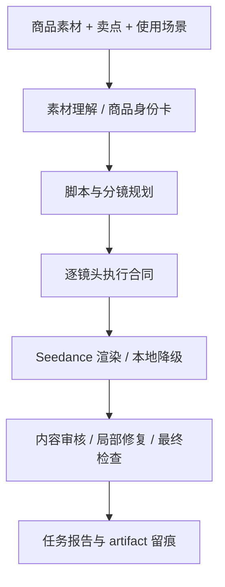

# 关键问题与解决方法说明

本说明用于补充完赛提报中的“关键工程难点与解决方案”。项目不是把商品图和卖点直接拼成一个超长 prompt，而是参考脚本中心式的视频生成思路：先把用户意图和素材理解转成可执行的分镜脚本，再由系统控制素材绑定、镜头风险、渲染和审核。

## 方法论来源

`The Script is All You Need` 这类脚本中心式框架给我们的启发是：视频模型本身擅长生成短片段，但不擅长从模糊需求里自己推导长期一致的故事、角色、场景和镜头边界。直接把“拍一条带货视频，突出卖点”交给视频模型，容易出现画面很漂亮但和剧本不一致、镜头之间身份漂移、动作顺序错乱的问题。

我们把这个思想迁移到电商带货场景时，遇到的核心对象不是电影角色，而是“商品”。商品的 logo、颜色、结构、比例和使用方式都必须稳定。因此项目采用了一个更适合商品视频的三层链路：

在这个链路里，LLM 负责理解素材、补全创意和生成候选脚本；规则系统负责约束边界、选择素材使用方式、保护商品身份、记录失败原因。这样做的目标是让系统既能讲带货故事，又不会因为追求画面丰富而牺牲商品真实性。

## 难点一：Logo 和商品身份容易漂移

最早的朴素方案是让模型直接看一张商品图，然后在 prompt 里写“保持同一个商品和 logo”。实际效果并不稳定。水杯这类外观特征明显、logo 精度要求低的商品，模型有时能靠文字复刻出“看起来像同一件商品”的结果；但笔记本电脑、带品牌标识的包装、带文字的电子产品很容易出现 logo 被重画、字母变形、主体从笔记本变成书本、A 面和屏幕结构混乱等问题。

项目里的解决方式是把 logo 问题从“文案要求”变成“身份约束”：

1. 多模态素材分析阶段先生成商品身份卡，记录商品类型、外观摘要、关键组件、可见标识、必须保持的结构和禁止变化。
2. 分镜规划阶段不只写“拍得高级”，而是明确每个镜头是否需要真实素材锚定、是否允许文字复刻、是否涉及高风险角度变化。
3. 渲染前把 `visible_marks`、`must_preserve`、`forbidden_changes` 传入镜头合同，避免下游 prompt 再要求模型新增文字、重画 logo 或做大幅翻转。
4. 内容审核阶段抽帧检查商品是否仍然像上传素材，发现错误 logo、错误商品、结构漂移时进入 `needs_review` 或局部修复，而不是把失败视频伪装成成功。

这套做法的重点不是保证每次都完美复刻 logo，而是让系统知道“什么时候 logo 是高风险对象”。当模型没有足够能力稳定重绘 logo 时，系统应优先使用真实素材锚定或降低动作幅度；当素材质量不足时，结果页和任务报告要明确记录风险，方便人工判断是否需要补充素材。

## 难点二：强绑定素材会稳定，但视频会变得像动图

在实验中，我们尝试过“所有商品镜头都从上传素材首帧强制出发”。这个策略解决了一部分身份漂移问题，但带来了新的失败：商品确实不太变形了，画面却只是在原始图片上加光影、轻微晃动、手臂触碰或水面波动。对带货视频来说，这种结果太单薄，无法真正表现便携、大容量、收纳、使用结果等卖点。

因此当前系统没有把“强绑定素材”当成唯一答案，而是把素材使用拆成多种职责：

- 外观确认镜头：优先使用上传素材，保证用户第一眼知道视频里的商品来自真实素材。
- 动作证明镜头：只选择低风险动作，例如短距离拿起、轻触、摆放、材质展示，避免在同一镜头中完成开合、翻转、跨场景和复杂手部交互。
- 场景化结果镜头：允许更自由的生活场景表达，但必须通过商品身份卡和 prompt skill 把商品外观、比例和可见关系写清楚。
- 空场景或痛点镜头：可以不出现商品，用来表达痛点或使用前状态，但不能生成同类替代商品，避免和真实商品镜头割裂。

这相当于把电影生成里的“frame anchoring”改造成商品场景里的“identity anchoring”：需要保真时锚定真实素材，需要讲故事时使用可控的新场景，但不能让同一个镜头同时承担“真实素材复刻”和“新地点复杂剧情”两个冲突目标。

## 难点三：不强绑定素材时，画面丰富但可能不是原商品

另一个方向是完全放开素材绑定，只用文字描述商品外观。部分水杯视频确实能得到更自然的场景：例如从包里拿出水杯、放进背包侧袋、晨光下手持使用。这个结果说明视频模型具备较强的单场景生成能力。但它也暴露了边界：对笔记本这类结构和 logo 要求更高的商品，模型容易自己生成一个“类似的笔记本”，而不是上传素材里的那台电脑。

所以系统当前采用的是 A/B 策略，而不是在保守和激进之间二选一：

- A 版偏保真：优先保证上传商品出现、结构稳定、logo 风险可控，适合检查商品真实性。
- B 版偏带货：更积极地尝试场景化使用和卖点证明，适合判断商品视频是否有转化表达。

用户在剧本确认页可以同时看到两个方向并修改分镜。系统最后也会尽量同时输出两个视频，结果页并排展示，避免把一个不稳定策略强行当作唯一答案。

## 难点四：剧本好看不等于视频模型能理解

实验中还有一个典型问题：LLM 写出的剧本看起来合理，但视频模型对时间、空间和动作边界理解较弱。例如一句“最后展示通勤者穿过办公楼入口，手边带着这个水杯”，模型可能不会理解这是新分镜的新场景，而是在上一帧背包水杯旁边硬塞一个路人和另一个杯子。

因此我们把剧本拆成“面向用户的故事”和“面向视频模型的可执行镜头”两层：

- 给用户看的剧本说明卖点、场景和表达方向，语言可以自然。
- 给视频模型的 prompt 必须具体到时间关系、空间关系、主体位置、动作起点、接触、变化和结束状态。
- 每个镜头只表达一个主要动作，避免 5 秒内同时要求拿起、旋转、开盖、走路、喝水和切换地点。
- 内部策略标签、风险评分、JSON 字段不会直接塞进最终视频 prompt，避免模型被复杂结构干扰。

这也是项目引入 prompt skill 文档的原因。代码不硬写“水杯就这样拍、笔记本就那样拍”，而是把可靠的正例、反例和镜头模板沉淀为 skill，让 LLM 在生成剧本时有可参考的方法论，同时由规则层做最后的合约检查。

## 难点五：长任务和失败结果必须可复核

视频生成链路耗时长，并且经常出现网络超时、模型限流、下载失败、审核不通过和局部修复失败。如果只在前端显示“生成失败”或“生成完成”，评委和开发者都无法判断问题出在素材、剧本、分镜、渲染还是审核。

项目把复核能力作为工程能力的一部分：

- 任务状态持续记录阶段进度和最近事件。
- 每次工作流输出 artifact，包括素材分析、商品身份卡、剧本、分镜、素材匹配、创作计划、渲染结果、内容审核和最终检查。
- 结果页显示 A/B 视频、分镜详情、素材匹配、内容审核和生成 Trace。
- `/tasks/{task_id}/report.json` 可导出结构化任务报告，用于答辩或失败复盘。
- `/api/health` 可检查模型开关、端口、服务实例和任务数量，避免评审运行时只看到黑盒状态。

## 当前方案的边界

当前版本仍是可运行 MVP，不是生产级商品视频系统。它解决的是“从素材到剧本到视频的工程链路可跑通、可审查、可复核”，并通过商品身份卡和 prompt skill 降低 logo 漂移、错误商品和无意义镜头的概率。

它还没有完全解决的问题包括：

- 对高精度 logo 和复杂文字的稳定复刻仍依赖视频模型能力。
- 单张素材能支持的动作扩展有限，复杂使用场景最好补充更多角度或使用过程素材。
- B 版场景化表达更接近带货视频，但也更容易出现商品复刻误差，需要人工选择和后续阈值调优。
- 当前数据回流以 artifact 和人工评估为主，尚未接入真实投放转化数据。

因此项目的取舍是：先做一个能解释、能复核、能持续迭代的 Agent 链路，而不是追求一次性生成最炫的视频。这个方向与比赛对“方法论、工程链路和创新思路”的要求更一致，也为后续接入更多素材、真实转化数据和更强视频模型留下了明确扩展点。
